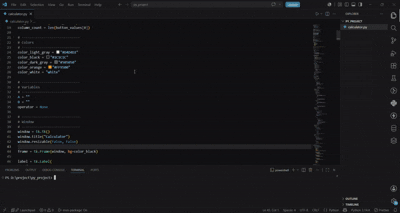

# Python Calculator

A simple calculator application built with Python and Tkinter as part of my Python programming practice.

## Features

- Addition
- Subtraction
- Multiplication
- Division
- Square Root
- Percentage
- Positive/Negative Toggle
- Decimal Numbers
- Clear (AC)
- Responsive Display Font

## Technologies

- Python 3
- Tkinter

## Project Purpose

This project was created to strengthen my understanding of:

- Python programming
- GUI development with Tkinter
- Event-driven programming
- Functions and modular code
- Calculator logic implementation

## How to Run

1. Clone this repository.

```bash
git clone https://github.com/yourusername/python-practice-calculator.git
```

2. Navigate to the project folder.

```bash
cd python-practice-calculator
```

3. Run the application.

```bash
python calculator.py
```

## Preview


================================================



## License

This project is for educational and practice purposes.
